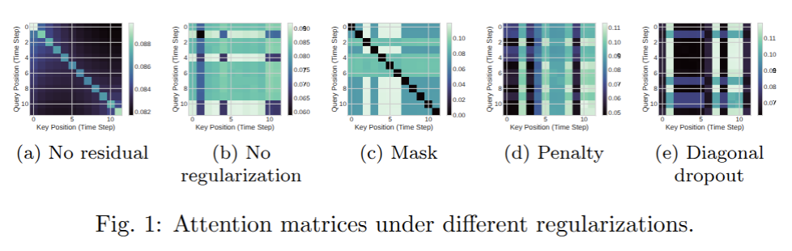

# Stochastic Parroting in Temporal Attention – Regulating the Diagonal Sink

Spatio-temporal models analyze spatial structures and tempo-
ral dynamics, which makes them prone to information degeneration among
space and time. 
Prior literature has demonstrated that over-squashing in
causal attention or temporal convolutions creates a bias on the first tokens.

To analyze whether such a bias is present in temporal attention mecha-
nisms, we derive **sensitivity bounds on the expected value of the Jacobian
of a temporal attention layer**. We theoretically show how off-diagonal
attention scores depend on the sequence length, and that temporal atten-
tion matrices suffer a **diagonal attention sink**. We suggest **regularization**
methods, and experimentally demonstrate their effectiveness.

[](https://doi.org/10.48550/arXiv.2602.10956)
[](LICENSE)

This repository accompanies the publication at *ESANN 2026*:
> Citation will be added after the conference took place.

An extended version can be found on arXiv:
> https://arxiv.org/abs/2602.10956.
---


## Contents

- [Overview](#overview)
- [Quickstart](#quickstart)
- [Installation](#installation)
  - [Option A: uv (recommended)](#option-a-uv-recommended)
  - [Option B: conda](#option-c-conda)
- [Paper Results](#reproducing-paper-results)
- [Citation](#citation)

---

## Overview

This repository contains code and resources related to the scientific paper titled 
"Stochastic Parroting in Temporal Attention – Regulating the Diagonal Sink" - accepted at ESANN 2026. 
It includes the scripts, datasets, and environment setup necessary to reproduce the experiments and results presented in the paper.

---

## Quickstart

After installation, you can access the main entry point via:

```bash
# Basic run
python -m src.run --config src/config/config.json --gpu

# if using uv
uv run python -m src.run --config src/config/config.json --gpu

# Custom seed and output folder
python -m src.run \
    --config src/config/config.json \
    --seed 333 \
    --output_dir ./results \
    --name "test_run_v1"
# or
uv run python -m src.run \
    --config src/config/config.json \
    --seed 333 \
    --output_dir ./results \
    --name "test_run_v1"
```

## Installation

This repository supports two installation workflows: **uv** or **conda**.

### ⚠️ Reproducibility note

All experiments reported in the paper were conducted using **Python 3.10**, **PyTorch 2.4**, and **CUDA 12.4**.
For exact reproduction of the results, we strongly recommend using the **Conda environment** described below.
The parameter choices can be found below in the Table. You can edit src/config/config.json.

---

### Prerequisites

- Python **3.10**
- NVIDIA GPU with CUDA support (CUDA **12.4** used for experiments)
- Appropriate NVIDIA driver for CUDA 12.x

CPU-only execution is possible but may lead to longer runtimes and has not been benchmarked.

---

### Option A: uv (recommended for general use)

1. Set-up using `uv`:
```bash
uv sync
uv run python -c "import torch; import torch_scatter; print(f'Success! Torch: {torch.__version__}, CUDA: {torch.cuda.is_available()}')"
```
2. Set-up using `conda`:
```bash
conda env create -f env.yml
conda activate torch12
```

## Paper Results
Recent work on over-squashing in spatio-temporal models has focused on Temporal Convolution [6]. 
We advance the understanding of information degeneration in spatio-temporal models by deriving sensitivity bounds on the Jacobian of temporal attention layers. We prove the existence of diagonal attention sinks, induced by the residual and the weight matrix of the query. While full diagonal masks suppress the query part of the softmax attention, resulting in attention emphasizing specific keys for the whole sequence, diagonal penalty and diagonal dropout significantly improve the performance of temporal attention layers.



### 📊 Performance Metrics

| Model | MAE-3 | MAE-6 | MAE-12 | RMSE-3 | RMSE-6 | RMSE-12 | MAPE-3 | MAPE-6 | MAPE-12 |
| :--- | :---: | :---: | :---: | :---: | :---: | :---: | :---: | :---: | :---: |
| **(a) No residual** | 3.165 ± 0.028 | 3.671 ± 0.064 | 4.627 ± 0.113 | 6.190 ± 0.050 | 7.414 ± 0.144 | 9.315 ± 0.227 | 8.705 ± 0.268 | 10.286 ± 0.202 | 13.406 ± 0.185 |
| **(b) No regularization** | 2.966 ± 0.022 | 3.443 ± 0.006 | 3.989 ± 0.019 | 5.881 ± 0.045 | 7.028 ± 0.054 | 8.418 ± 0.053 | 7.836 ± 0.041 | 9.670 ± 0.082 | 11.708 ± 0.158 |
| **(c) Full diagonal mask** | 2.969 ± 0.019 | 3.447 ± 0.022 | 3.997 ± 0.026 | 5.889 ± 0.015 | 7.000 ± 0.017 | 8.431 ± 0.024 | **7.830 ± 0.060** | 9.666 ± 0.100 | 11.734 ± 0.083 |
| **(d) Diagonal dropout** | **2.959 ± 0.001** | **3.415 ± 0.010** | **3.940 ± 0.011** | **5.845 ± 0.029** | 7.006 ± 0.051 | **8.338 ± 0.041** | 7.833 ± 0.003 | **9.616 ± 0.037** | **11.570 ± 0.047** |
| **(e) Diagonal penalty** | 2.969 ± 0.027 | 3.436 ± 0.037 | 3.964 ± 0.041 | 5.859 ± 0.034 | **6.995 ± 0.054** | 8.344 ± 0.105 | 7.842 ± 0.070 | 9.655 ± 0.120 | 11.623 ± 0.157 |

## Citations

[1] Di Giovanni, F., Giusti, L., Barbero, F., Luise, G., Liò, P., & Bronstein, M. (2023).
On over-squashing in message passing neural networks: the impact of width, depth, and topology.
In Proceedings of the 40th International Conference on Machine Learning (ICML).

[2] Arroyo, A., Gravina, A., Gutteridge, B., Barbero, F., Gallicchio, C., Dong, X., Bronstein, M., & Vandergheynst, P. (2025).
On vanishing gradients, over-smoothing, and over-squashing in GNNs: Bridging recurrent and graph learning.
arXiv preprint arXiv:2502.10818

[3] Eliasof, M., Haber, E., & Treister, E. (2024).
Feature transportation improves graph neural networks.
In Proceedings of the AAAI Conference on Artificial Intelligence, 38(11), 11874–11882.

[4] Gravina, A., Eliasof, M., Gallicchio, C., Bacciu, D., & Schoenlieb, C.-B. (2025).
On over-squashing in graph neural networks through the lens of dynamical systems.
In Proceedings of the AAAI Conference on Artificial Intelligence, 39(16), 16906–16914.

[5] Heilig, S., Gravina, A., Trenta, A., Gallicchio, C., & Bacciu, D. (2025).
Port-Hamiltonian architectural bias for long-range propagation in deep graph networks.
In Proceedings of the 13th International Conference on Learning Representations (ICLR).

[6] Marisca, I., Bamberger, J., Alippi, C., & Bronstein, M. M. (2025).
Over-squashing in spatiotemporal graph neural networks.
arXiv preprint arXiv:2506.15507

[7] Xiao, G., Tian, Y., Chen, B., Han, S., & Lewis, M. (2024).
Efficient streaming language models with attention sinks.
In Proceedings of the International Conference on Learning Representations (ICLR).

[8] Barbero, F., Banino, A., Kapturowski, S., Kumaran, D., Araújo, J. G. M., Vitvitskyi, A., Pascanu, R., & Veličković, P. (2024).
Transformers need glasses! Information over-squashing in language tasks.
In Proceedings of the Neural Information Processing Systems Conference (NeurIPS).

[9] Shi, H., Gao, J., Ren, X., Xu, H., Liang, X., Li, Z., & Kwok, J. T. (2021).
SparseBERT: Rethinking the importance analysis in self-attention.
In Proceedings of the International Conference on Machine Learning (ICML).

[10] Li, Y., Yu, R., Shahabi, C., & Liu, Y. (2018).
Diffusion convolutional recurrent neural network: Data-driven traffic forecasting.
In Proceedings of the International Conference on Learning Representations (ICLR).

[11] Foumani, N. M., Tan, C. W., Webb, G. I., et al. (2024).
Improving position encoding of transformers for multivariate time series classification.
Data Mining and Knowledge Discovery (DMKD), 38, 22–48.
